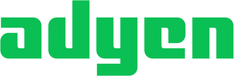

<div align="center">
  <h1>Next.js Storefront</h1>
</div>

<div align="center">
  <p><b>Next.js Storefront</b>: Your open-source frontend starter pack for building performant e-commerce experiences with <a href="https://github.com/saleor/saleor">Saleor</a>.
  <p><b>Saleor Checkout</b>: Extensible Next.js checkout application and payment integrations powered by Saleor API.</p>
</div>

<div align="center">
  <a href="https://saleor.io/">🏠 Website</a>
  <span> • </span>
  <a href="https://docs.saleor.io/docs/3.x/">📚 Docs</a>
  <span> • </span>
  <a href="https://saleor.io/blog/">📰 Blog</a>
  <span> • </span>
  <a href="https://twitter.com/getsaleor">🐦 Twitter</a>
</div>

<div align="center">
  <a href="https://demo.saleor.io/">▶️ Demo</a>
   <span> • </span>
  <a href="https://githubbox.com/saleor/react-storefront">🔎 Explore Code</a>
</div>

## Motivation

🏎️ **modern & fast**:
The project utilizes all the best practices for e-commerce, like SSR, ISR, and image optimization.

💳 **integrated payments**:
Reduce the purchase friction by taking advantage of integrations with modern payment providers such as Adyen, Mollie or Stripe.

🛠️ **easily customizable**:
TailwindCSS can be easily extended and tweaked, or completely replaced with your favorite CSS solution.

👌 **works out-of-the-box**:
Pre-configured tools built with DX in mind.

## Stack

- Next.js
- TypeScript
- GraphQL with Apollo Client
- Tailwind CSS
- Turborepo
- Saleor Checkout

## Quickstart

Supercharge your development with our CLI tool and free developer account at [Saleor Cloud](https://cloud.saleor.io/). To download and install Saleor CLI, run the following command:

```
npm i -g @saleor/cli
```

[Learn more about Saleor CLI](https://docs.saleor.io/docs/3.x/cli)

Set up your local storefront development environment by running the storefront create command with --demo attribute. It will create a fresh clone, install dependencies and create a Saleor instance in the Saleor Cloud. The backend will be set to the newly created Cloud instance.

```
saleor storefront create --demo
```

You can also spawn your local storefront development environment without using the --demo attribute. It will create a fresh clone and install dependencies. The default configuration uses the master staging environment of the Saleor Cloud as a backend.

```
saleor storefront create
```

---

## Development

First install [`pnpm`](https://pnpm.io/) (an alternative to `npm`, focused on performance) globally:

```
npm install -g pnpm
```

Then install dependencies:

```
pnpm i
```

To start the servers, run:

```
pnpm dev
```

[The command will boot up 4 applications running on different ports](./docs/development.md#ports).

Read more about development in [docs/development.md](./docs/development.md).

## Payment gateways

Saleor App Checkout supports three configurable payment gateways:

<a href="https://www.mollie.com/en">
  <picture>
    <source media="(prefers-color-scheme: dark)" srcset="./docs/logos/mollie_light.svg">
    <source media="(prefers-color-scheme: light)" srcset="./docs/logos/mollie_dark.svg">
    
  </picture>
</a>

<br>

[](https://www.adyen.com/)

[](https://stripe.com/)

For further information, please go to [docs/payment/index.md](./docs/payment/index.md).

## Deployment

Read Vercel deployment guide in [docs/vercel.md](./docs/vercel.md)

## FAQ

Read FAQ in [docs/faq.md](./docs/faq.md)

# MESSAGE
